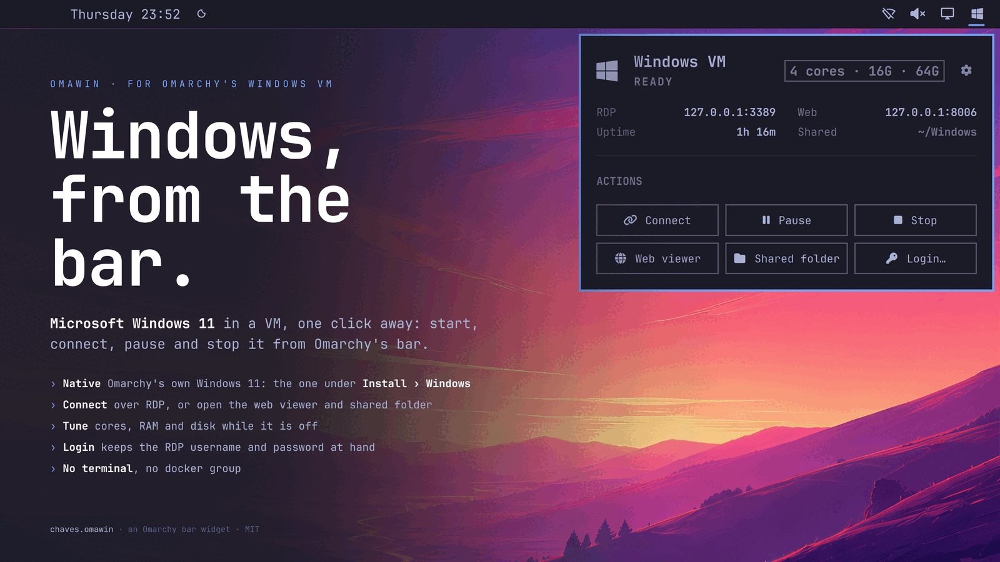
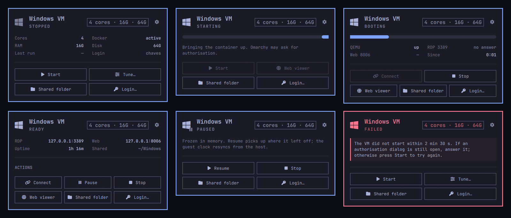
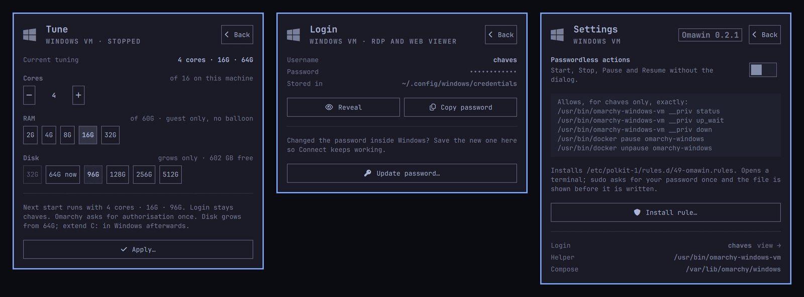

<p align="center"></p>

# Omawin

[](https://github.com/tcballard/omarchy-badges)

**Windows, from the bar.** Omarchy ships a Windows 11 VM (*Install › Windows*
in the Omarchy menu). Omawin puts it in the bar: one glyph that says whether
Windows is up, and a card to **start, connect, pause, resume and stop** it,
open the web viewer and the shared folder, **tune** its cores, RAM and disk,
and keep its **login** a click away.

It needs no `docker` group and no configuration: it reads the VM's state
unprivileged and acts through Omarchy's own `omarchy-windows-vm` helper, the
same one the launcher entry runs.

## What you need

- **Omarchy 4** with its Quickshell shell (built and tested against 4.0.3).
- **Omarchy's Windows VM.** Not installed yet? The card has an **Install**
  button that runs Omarchy's own installer.

## Install

```sh
omarchy plugin add https://github.com/diogochaves/omarchy-omawin --enable
```

The Windows glyph appears in the bar. To place it:

```sh
omarchy bar move chaves.omawin --section right --after omarchy.tray
```

Start, Stop, Pause and Resume ask for your password each time until you turn
on **Passwordless actions** in the card's Settings. Tune and Update password
always ask.

**Update** with `omarchy plugin update chaves.omawin`.

## Remove

```sh
omarchy plugin remove chaves.omawin
```

The VM itself is Omarchy's and stays. Two things of Omawin's can stay behind:

- `~/.local/state/omawin/`, the card's memory of the last run:
  `rm -r ~/.local/state/omawin`.
- The polkit rule, only if you turned on Passwordless actions. Turn it off in
  Settings **before** removing the plugin, or afterwards run
  `sudo rm /etc/polkit-1/rules.d/49-omawin.rules`.

## Using it

**Left click** the glyph for the card; **middle click** starts the VM, or
connects when it is up. Hover for its state, shape and uptime.

<p></p>

- **Stopped**: Start, and Tune the shape the next start will use.
- **Starting / Booting**: the VM is coming up. The web viewer already works
  while Windows boots, which is where you watch a first install.
- **Ready**: Connect opens the Windows window. Pause, Stop, Web viewer.
- **Paused**: frozen in memory, using no CPU. Resume picks up where it left
  off and reopens the window.
- **Failed**: what went wrong, and what to try. The buttons underneath still
  work, so you can retry.

Every card has **Shared folder** (`~/Windows`, a network drive inside
Windows) and **Login…**.

<p></p>

- **Tune** (VM off) sets cores, RAM and disk for the next start. The disk can
  only grow; after it does, extend C: in Windows' Disk Management and the card
  reminds you how.
- **Login** shows the RDP username, and reveals or copies the password. A
  copied password stays out of Omarchy's clipboard history and is cleared
  after 30 s. Changed the password inside Windows? **Update password…** so
  Connect keeps working.
- **Settings** (the gear) turns **Passwordless actions** on or off: a polkit
  rule that lets Start, Stop, Pause and Resume run without a dialog, for you
  only. It opens a terminal, shows you the rule and asks before writing it.

**‹ Back** at the top right, or **Esc**, goes back.

## What it touches

- **Reads**, as you: `/proc` and a cgroup file for the VM's state, the size of
  `~/.windows/data.img`, the username in `~/.config/windows/credentials`, and
  the RDP and web viewer ports on `127.0.0.1`. Nothing leaves the machine.
- **Runs**: Omarchy's `omarchy-windows-vm` for start and stop, and
  `pkexec docker pause|unpause omarchy-windows`. Tune and Update password
  rewrite the VM's compose through the helper's own validated writer.
  Passwords go on stdin, never on a command line.
- **Writes**: `~/.local/state/omawin/`, the credentials file when you update
  the password, and the VM's compose through Omarchy's helper. No other
  configuration is touched.

The full list, the Pause and Stop details, the tuning table and what the
polkit rule allows are in [Under the hood](docs/under-the-hood.md). Working on
the widget: [Developing](docs/developing.md). What changed:
[CHANGELOG](CHANGELOG.md).

## License

MIT.
