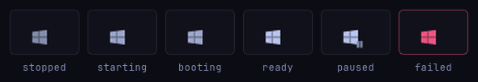
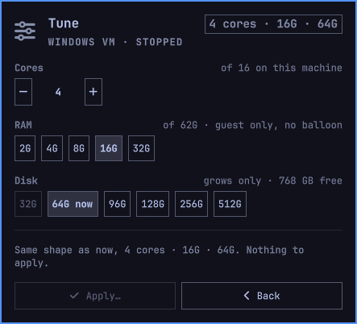
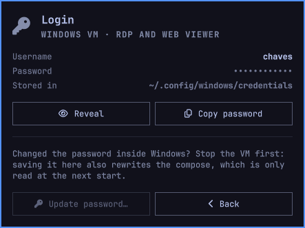
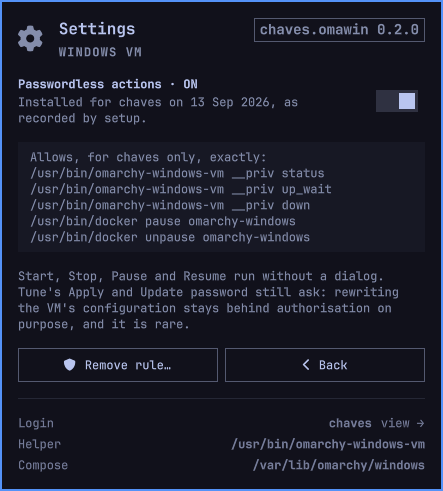

<p align="center"></p>

# Omawin

[](https://github.com/tcballard/omarchy-badges)

**Windows, from the bar.** Omarchy ships a Windows 11 VM — *Install › Windows*
in the Omarchy menu — and gives you a launcher entry to open it. Omawin is the
rest of the control panel: one glyph in the bar that says whether Windows is
up, and a card with **Start, Connect, Pause, Resume, Stop**, the web viewer and
the shared folder. Behind it, **Tune** changes the VM's cores, RAM and disk,
**Login** keeps the RDP username and password a click away, and **Settings**
turns the optional passwordless rule on and off.

It does all of that without the Docker socket. Omarchy keeps you out of the
`docker` group on purpose (that group is root-equivalent), so the widget reads the VM's
state from `/proc`, a cgroup freeze file and a knock on the RDP port, and acts
through Omarchy's own `omarchy-windows-vm` helper — the same thing the launcher
entry runs. Nothing to join, nothing to configure.

## Contents

- [What you need](#what-you-need)
- [Install](#install), [Update](#update), [Remove](#remove)
- [Using it](#using-it): [the glyph](#the-glyph), [the card](#the-card),
  [Tune](#tune), [Login](#login), [Settings](#settings)
- [Under the hood](#under-the-hood): [what it runs, reads and writes](#what-it-runs-reads-and-writes),
  [Pause and Resume](#pause-and-resume), [the cache](#cache),
  [tuning the VM](#tuning-the-vm), [the polkit rule](#polkit-rule)
- [Developing](#developing), [License](#license)

## What you need

- **Omarchy 4** (Quattro) with its Quickshell shell — built and tested against
  4.0.3 and the `omarchy-windows-vm` it ships. The widget leans on that
  helper's internal entry points, so an Omarchy release that changes them
  will need a widget update; `omarchy plugin update` is how that arrives.
- **Omarchy's Windows VM.** Not installed yet? The card has an Install button
  that runs Omarchy's own installer in a floating terminal, or use
  *Install › Windows* from the Omarchy menu. It downloads Windows 11 and takes a
  while; the web viewer shows the progress.

Nothing else: no packages, no `docker` group, no edits to your config.

## Install

```sh
omarchy plugin add https://github.com/diogochaves/omarchy-omawin --enable
```

Then look for the Windows glyph in the bar. To put it somewhere specific:

```sh
omarchy bar move chaves.omawin --section right --after omarchy.tray
```

That is the whole install. Every privileged step — starting, stopping,
pausing — raises Omarchy's authentication dialog, once per press, until you
turn on the optional polkit rule from the card's Settings face
([below](#settings)). Tune and Update password ask either way.

## Update

```sh
omarchy plugin update chaves.omawin
```

## Remove

```sh
omarchy plugin remove chaves.omawin
```

What can stay behind, and how to take it out:

| Artifact | After removal | To remove it |
|----------|---------------|--------------|
| `~/.local/state/omawin/state.json` (`$XDG_STATE_HOME/omawin/`) | kept | `rm -r ~/.local/state/omawin` |
| `/etc/polkit-1/rules.d/49-omawin.rules` — only if you ran `setup` | kept | `sudo ./setup polkit --remove` **before** removing the plugin, or `sudo rm /etc/polkit-1/rules.d/49-omawin.rules` after |
| `~/.local/state/omawin/49-omawin.rules` — the user-owned copy `setup` leaves so the Settings switch can read the rule's state | kept | taken out by the same `sudo ./setup polkit --remove`, or `rm ~/.local/state/omawin/49-omawin.rules` |
| the transient unit `omawin-launch.service` | exists only while an RDP window is open; gone when it closes | `systemctl --user stop omawin-launch` |

Nothing else: no packages, no hooks, no edits to Hyprland or shell config.
The VM itself is Omarchy's and is not touched by removing the widget.

## Using it

### The glyph

<p></p>

One Windows mark, coloured by state: dimmed while the VM is off, lit when it
is ready, pulsing while it comes up or goes down, badged while it is paused,
red when something failed. Hover for the state, the VM's shape and its uptime.
**Left click** opens the card; **middle click** is the shortcut — Start when
the VM is off, Connect when it is up.

### The card

<p></p>

One face per state, with only the buttons that make sense there:

- **Stopped** — Start, Tune…, and the shape the next start will use.
- **Starting** — the container is coming up; Omarchy may ask for
  authorisation.
- **Booting** — QEMU is up and the card waits for Windows to answer on RDP.
  The web viewer already works here, which is where you watch a first install.
- **Ready** — Connect opens the RDP window (Omarchy's own launcher, in a user
  unit, so it survives a bar reload). Pause, Stop, Web viewer.
- **Paused** — frozen in memory, using no CPU. Resume picks up where it left
  off and reopens the window. Stop unpauses first, so Windows shuts down
  cleanly.
- **Failed** — what went wrong: the last line Omarchy's launcher, pkexec or
  xfreerdp printed, or, when a start or stop simply took too long, which one
  and what to try. The buttons are those of the state underneath, so you can
  retry. The next successful action clears it.

Every card ends with **Shared folder** and **Login…**: *Shared folder* opens
`~/Windows`, which the guest sees as a network drive, and *Login…* opens the
[Login](#login) face. *Web viewer* opens `http://127.0.0.1:8006`, the VM's
console in the browser, which asks for that login.

Tune, Login and Settings open over the card. The **‹** at the top left of
each goes back one step, and so does **Esc**; Esc closes the card only from
the card itself.

### Tune

<p></p>

Cores up to what the machine has, RAM from the installer's own list up to
what fits, disk in the same steps — grow only, because the VM's disk image
cannot shrink. Apply writes the new shape through the one privileged action
Omarchy's installer itself ends on, with your login passed back unchanged, so
nothing is re-downloaded and the Windows account is untouched. One
authorisation. The VM has to be off; the new shape is used by the next Start.

### Login

<p></p>

The RDP username and password Omarchy stored at install, for when the RDP
client or the web viewer asks. **Reveal** shows the password for 15 seconds,
**Copy** puts it on the clipboard for 30, marked sensitive so Omarchy's
clipboard history skips it, and clears it afterwards unless you have copied
something else since. Changed the password *inside*
Windows? **Update password…** writes the new one down so Connect keeps working
(VM off, one authorisation).

### Settings

<p></p>

Behind the gear in the card's title. The switch installs or removes an
optional polkit rule that lets Start, Stop, Pause and Resume run without a
dialog — for you only, for exactly the five command lines shown on the face,
and nothing else. It runs `sudo` in a floating terminal, shows you the file,
and asks before writing it. Tune and Update password keep asking on purpose;
see [Polkit rule](#polkit-rule) for what it says and why.

## Under the hood

### What it runs, reads and writes

- **Reads**, unprivileged: `/proc/<pid>/{comm,cgroup,cmdline,stat}` of the
  QEMU process to find it and its `-smp`/`-m`, `/proc/stat` for `btime`, the
  scope's `cgroup.freeze` under `/sys/fs/cgroup`, and whether
  `/var/lib/omarchy/windows/docker-compose.yml` and
  `~/.config/windows/credentials` exist (or, on an install from before Omarchy
  moved its compose, whether `~/.config/windows/docker-compose.yml` does: the
  first Start moves it, and until then the login is read from it). Plus `systemctl is-active
  docker.service`, `systemctl --user is-active omawin-launch` and, after a
  launch ends, the user journal of that one unit.
  For the shape and the login: the apparent size of `~/.windows/data.img`
  (`stat -c %s` — the compose is `root:docker 0640` and cannot be read, so that
  sparse file is the only readable record of `DISK_SIZE`), the `USERNAME` line
  of the credentials file on every sample and its `PASSWORD` line only when
  Reveal, Copy or Save asks, `nproc`, `MemTotal`, `df` of `~/.windows`,
  `timedatectl show -p Timezone`, and `~/.local/state/omawin/49-omawin.rules`
  — the copy `setup` leaves behind, which is how the Settings switch knows.
- **Network**: loopback only. A 19-byte X.224 Connection Request to
  `127.0.0.1:3389` and a request to `http://127.0.0.1:8006/` for its status
  code. Nothing leaves the machine.
- **Runs**: `/usr/bin/omarchy-windows-vm launch -k` inside the transient user
  unit `omawin-launch` (through `systemd-run --user`, so the RDP session
  survives a bar reload), `/usr/bin/omarchy-windows-vm stop`,
  `/usr/bin/omarchy-windows-vm install` in Omarchy's floating terminal,
  `/usr/bin/pkexec /usr/bin/docker pause|unpause omarchy-windows`,
  `systemctl --user stop omawin-launch`, and `xdg-open` on
  `http://127.0.0.1:8006` and `~/Windows`. Tune and Update password add
  `/usr/bin/pkexec /usr/bin/omarchy-windows-vm __priv write_compose` with the
  six `KEY=VALUE` lines on **stdin**; Copy password adds `/usr/bin/wl-copy --sensitive`
  (and, 30 s later, `wl-paste` plus `wl-copy --clear` if the clipboard still
  holds the password); the Settings switch adds
  `sudo <plugin dir>/setup polkit [--remove]` in Omarchy's floating terminal.
  Every command is a constant with an absolute path; nothing is built from
  data, and no password is ever an argument — `/proc/<pid>/cmdline` is
  world-readable, so the password goes in on stdin or not at all.
- **Writes**: `$XDG_STATE_HOME/omawin/state.json` (see [Cache](#cache)),
  `~/.config/windows/credentials` when you save a new password (rewritten
  atomically, 0600, exactly as `omarchy-windows-vm` writes it), and
  `/var/lib/omarchy/windows/docker-compose.yml` — by asking root to, through
  the helper's own validated writer. `sudo ./setup polkit` writes the rule and
  a user-owned copy of it at `~/.local/state/omawin/49-omawin.rules`. None of
  your configuration is touched.
- **Privilege**: none of its own. `omarchy-windows-vm` calls pkexec itself for
  `__priv up_wait` and `__priv down`; pause, unpause and `write_compose` go
  through pkexec directly. The polkit rule is optional and installed by you, on
  purpose, from a terminal — and it does **not** cover `write_compose`, so Tune
  and Update password ask every time.

### Pause and Resume

Pause is `docker pause`: a cgroup freeze, so the guest stops using CPU but
keeps its RAM, and the compose's `-rtc base=localtime,clock=host,driftfix=slew`
lets the guest clock catch up on resume. It is not a suspend to disk and it
survives neither a reboot nor a `stop`.

**Pause closes the RDP window first.** The freeze stops the guest's RDP
server too, so an open session would sit on a frozen picture until its
connection timed out, and every click made on it meanwhile would be queued
and delivered to Windows on resume. So Pause stops the `omawin-launch` unit
(the launcher exits cleanly, the VM keeps running), then freezes. Resume
unfreezes and reopens the window in one press; Connect does the same from a
paused state whose window was already closed.

**Stop on a paused VM unpauses it first.** `docker compose down` would send
SIGTERM to a frozen process, wait out the full two-minute grace period and
then SIGKILL it — an unclean Windows shutdown. So Stop runs `unpause` and only
then `omarchy-windows-vm stop`, and an unpause that fails aborts the stop
instead of leaving it to time out. Every button, Stop included, is disabled
while a pause or unpause is in flight.

### Cache

`$XDG_STATE_HOME/omawin/state.json` (`~/.local/state/omawin/state.json` by
default) holds one object written from the last running sample:

```json
{ "cores": 4, "ram": "16G", "disk": "64G", "started": 1789232550,
  "lastSeen": 1789236870124,
  "pending": { "cores": 6, "ram": "16G", "disk": "96G" } }
```

That is the whole file: the VM's shape, when the last seen run of it started
(epoch seconds), when it was last seen running (epoch milliseconds), and —
only after a Tune — the shape the next start will use. It is what the stopped
card's `4 cores · 16G · 64G` pill, its Cores/RAM/Disk readings and its "Last
run" print — nothing else reads it and nothing else writes it. Deleting it is
safe: those readings go blank until the VM next runs, and the pill falls back
to what the sampler can see. It is rewritten when the shape changes and at most
once a minute otherwise.

`pending` is there because nothing else can tell you what a stopped VM will
start as: the compose that holds it is `root:docker 0640`. It is written by
Tune's Apply, shown as `next start 6 cores · 16G · 96G` in the tooltip, and
dropped again the moment QEMU appears — at which point the live sample is the
truth. `disk` is only a fallback for `~/.windows/data.img`, which is readable
whether or not the VM runs.

### Tuning the VM

What a "normal" VM offers and how to get it here, as far as Omarchy's helper
allows. The first three rows are the widget's **Tune** face now; the rest still
is not widget work, and it does not pretend otherwise:

| Want | How, here | Notes |
|------|-----------|-------|
| Change cores / RAM (VM off) | **Tune…** on the stopped card | Cores up to `nproc`, RAM from the installer's own list up to `MemTotal`. Apply pipes `RAM= CORES= DISK= USERNAME= PASSWORD= TZ=` into `pkexec omarchy-windows-vm __priv write_compose` — the single privileged action the `install` wizard itself ends on — with the login read out of `~/.config/windows/credentials` and passed back unchanged, so the guest account is never touched and nothing is re-downloaded. One authorisation. The new shape is consumed by the next Start, which is why the face exists only while the VM is off; until then the pill reads `next start …`. `omarchy-windows-vm install` still works and still re-asks everything, starts the VM immediately and opens the browser. |
| Change cores / RAM (VM on) | Not possible | No hotplug headroom in `-smp` (no `maxcpus`), no balloon device, and the QEMU monitor is `unix:/run/shm/monitor.sock` inside the container. Stop, change, start. |
| Grow the disk | **Tune…**, a bigger Disk chip | Grow only — dockur refuses to shrink `data.img`, so smaller sizes are dead on the card. Needs `DISK+10 GB` free, computed without subtracting the existing image, which is the wizard's own rule. Windows sees the extra space as unallocated: extend `C:` in Disk Management once it is up (right-click `C:`, **Extend Volume**). The running card reminds you after the start that grew it, until you dismiss it. If Extend Volume is greyed out, a Recovery partition sits between `C:` and the free space and has to be moved or deleted first. |
| Change the RDP password | **Login › Update password…** | Only after you have changed it *inside* Windows: this writes down what the machine sends, it cannot rename or re-password a Windows account. Rewrites the credentials file and, in the same breath, the compose's fallback copy of it — so stopped only, one authorisation. |
| Anything else dockur supports (KEYBOARD, REGION, LANGUAGE, DISK2_SIZE, extra ports, `/dev/bus/usb`, DHCP/macvlan networking) | `sudo` edit of `/var/lib/omarchy/windows/docker-compose.yml`, then stop/start | `assert_mounts_safe` only checks owner/mode, the two bind lines and `PROTECT`; extra keys survive. **The next `install` run overwrites them.** Keep a copy. |
| Snapshot / rollback (VM off) | `cp -a --reflink=always ~/.windows ~/.windows.snap-<date>` | On btrfs a reflink copy is instant and free until blocks diverge. Rollback = copy back while stopped. User-owned, no root. |
| Suspend to RAM | Pause | A cgroup freeze; see [Pause and Resume](#pause-and-resume). The guest clock resyncs on resume. |
| Suspend to disk | Not from outside | `savevm` needs qcow2 and the monitor. Windows' own Hibernate from inside the guest is untested. |
| Second VM | Not with the helper | Own compose, other ports, outside Omarchy. |
| Autostart at login | Not by default | Possible with the polkit rule plus a user unit that runs `omarchy-windows-vm launch -k`. |
| Logs / console | Web viewer on 8006 | `docker logs` needs the socket. |

### Polkit rule

Optional, and now a switch: **Settings** on the card (the gear in its title)
shows the rule in full, says whether it is installed and for whom, and turns it
on or off by running `sudo <plugin dir>/setup polkit [--remove]` in Omarchy's
floating terminal — where `sudo` asks once and the file is printed before it is
written. Nothing about that is quiet or automatic: a plugin install cannot and
should not write to `/etc`.

The widget works without it — every action just raises Omarchy's authentication
dialog. `polkit/49-omawin.rules.in` is rendered with `@USER@` filled in, shown
to you in full, and only then installed as
`/etc/polkit-1/rules.d/49-omawin.rules`. It says YES to exactly five command
lines for exactly one user:

```
/usr/bin/omarchy-windows-vm __priv status | up_wait | down
/usr/bin/docker pause | unpause omarchy-windows
```

So any process running as that user can start, stop, pause and query *this
one VM*. `up_wait` only ever runs Omarchy's root-owned, validated compose file
against pinned bind anchors — that is the point of the helper's design — so it
is not a path to arbitrary root. `write_compose` and `remove` keep prompting,
`docker` stays untouchable beyond pause/unpause of the `omarchy-windows`
container, and every other user and action falls through to the normal
prompt. The directory is `root:polkitd 0750`, so installing needs root;
polkitd notices the new file by itself, nothing is restarted.

**`write_compose` is deliberately left out**, even though Tune and Update
password use it. Rewriting the VM's configuration is rare and worth a dialog:
the rule is meant to make the start/stop cycle pleasant, not to hand every
process running as you a promptless way to rewrite what a root-invoked
`docker compose up` will consume. `setup polkit` even prints the two commands
to check that with, and the second one must still prompt.

Because that rules directory cannot be read as the user — no listing, no
`test -f`, and `pkcheck --detail` refuses an unprivileged caller — `setup` also
writes a user-owned copy of exactly what it installed to
`~/.local/state/omawin/49-omawin.rules` (0644) and deletes it on `--remove`.
The Settings switch is the presence of that copy; the user named inside it and
its mtime are the card's "Installed for X on <date>". It is a record, not the
truth: a rule removed by hand leaves the copy behind, which is why the card
says *as recorded by setup* and the first prompted action makes it obvious.

**Upgrading from 0.1.x with the rule already installed:** that copy does not
exist yet, so the switch reads as off. Press **Install rule…** once (or run
`sudo <plugin dir>/setup polkit`): the rule is rewritten unchanged and the copy
appears. Until then the only effect is the wrong switch; the actions are
already passwordless.

Check first that pkexec's action details are what the rule matches on. The
probe rule allows one read-only command line, `__priv status`, to the same one
user, on the same exact `program` + `command_line` test the real rule uses,
and nothing else (polkitd runs with `--log-level=notice` on Omarchy, so a
`polkit.log()` probe would show nothing). Run these from the plugin's folder,
`~/.config/omarchy/plugins/chaves.omawin`:

```sh
sudo ./setup polkit --probe
pkexec /usr/bin/omarchy-windows-vm __priv status         # must NOT prompt
pkexec /usr/bin/omarchy-windows-vm __priv status extra   # must prompt; cancel
sudo ./setup polkit                                      # the real rule; drops the probe
```

Each `setup` call prints the exact file it is about to install and waits for a
`y`; `--yes` skips the question. If you would rather not run a script as root
at all, the whole install is one line you can read first:

```sh
sed "s/@USER@/$USER/g" polkit/49-omawin.rules.in |
  sudo install -D -m 0644 -o root -g root /dev/stdin /etc/polkit-1/rules.d/49-omawin.rules
```

A prompt on the first probe call means the details differ on your box and the
rule must not be installed as written. Then verify, as the user:

```sh
pkexec /usr/bin/omarchy-windows-vm __priv status              # no dialog
pkexec /usr/bin/omarchy-windows-vm __priv write_compose </dev/null  # prompts
```

`sudo ./setup polkit --status` says which rules are installed and who they
name; `sudo ./setup polkit --remove` takes both back out. The rule is not
removed by `omarchy plugin remove`: see [Remove](#remove).

## Developing

Run it from a checkout instead of `plugin add`:

```sh
ln -s "$PWD" ~/.config/omarchy/plugins/chaves.omawin
omarchy-shell shell rescanPlugins
omarchy bar put chaves.omawin --before omarchy.power
```

`shell.json` hot-reloads, so the glyph appears at once; a changed `Panel.qml`
needs `omarchy restart shell`. Everything about the layout goes through
`omarchy bar` — never hand-edit `shell.json`. `node --test tests/` runs the
sampler, the probe, the state machine, the tune and credentials helpers and
`setup`, all unprivileged, against fixtures: `tests/fixtures/generate.sh`
rebuilds the fake `/proc`, `/sys`, compose, credentials and the sparse
`data.img` those use (that image is `.gitignore`'d — git would store all 64 GiB
of it — and the tests create it themselves if it is missing).

### IPC

`omarchy-shell chaves.omawin <method> [args]`, or
`qs -p /usr/share/omarchy/shell/shell.qml ipc call chaves.omawin <method>`.

| Method | Does |
|--------|------|
| `open` / `close` / `toggle` / `show` / `hide` | the popup |
| `status` | one line: the painted state, the `vm-state.sh` line behind it and the bar tooltip, e.g. `stopped installed=1 docker=active pid= frozen= cores= ram= web=000 cid= started= disk=64G login=chaves \| Windows VM · STOPPED · 4 cores · 16G · 64G` |
| `fail <text>` | **debug.** Paints the failed card with `<text>` as the message, without breaking anything to get there. Sticky like a real failure — cleared by the next successful action or state change, or at once with `fail ""`. |
| `mock <line> [probe] [action]` | **debug.** Stands `<line>` in for `vm-state.sh`, `probe` (`ok`/`no`) in for the RDP probe and `action` (`start`/`stop`) in for a pending transient, so every face of the card can be looked at with the VM switched off. `mock "" "" ""` (all three arguments are required by the IPC) hands the widget back to the real sampler and drops the mocked transient. |
| `face <name>` | **debug.** Shows one face of the card — `live`, `tune`, `login`, `updatePassword` or `settings` — seeded the way a press would seed it, so the sub-faces can be looked at (and screenshotted) without pressing through to them. Anything else means `live`. The two faces that rewrite the compose still close themselves when the VM is not stopped. |

The three debug methods only paint: a mocked line never reaches the cache file
and none of them runs a command. Text given to them is capped and stripped
of control characters like any helper output.

### Test hooks

The helpers read a few environment variables so the tests can point them at
fixtures: `PROC_ROOT`, `SYS_ROOT`, `COMPOSE_FILE`, `CREDENTIALS_FILE`,
`DOCKER_STATE`, `WEB_CODE` for `vm-state.sh`; `RDP_HOST`, `RDP_PORT`,
`RDP_TIMEOUT`, `RDP_PROTOCOLS` for `rdp-probe.sh` (shape-checked, the probe
refuses anything but a dotted IPv4 address); `DATA_IMAGE` for the disk reading;
`HOST_CORES`, `HOST_RAM_GB`, `FREE_GB`, `WINDOWS_DIR`, `TZ_NAME` and
`TUNE_DRY_RUN` for `tune.sh`; `CREDS_DRY_RUN` for `credentials.sh`;
`OMAWIN_STATE_DIR` for `rule-state.sh`; `POLKIT_RULES_DIR`,
`SETUP_SKIP_ROOT_CHECK`, `OMAWIN_STATE_DIR` and `SETUP_TARGET_HOME` for
`setup`. The two dry runs stop before the one `pkexec` call and print what they
would have piped into it, with the password replaced by `***`. Nothing selects
a program to run: the unit name and every command line are constants.

### Layout

- `helpers/vm-state.sh`, `helpers/rdp-probe.sh` and the pure state machine in
  `lib/State.js`, with `node --test tests/` over all three. The sampler also
  reports `started=`, the QEMU process's start time in epoch seconds, read
  from `/proc/<pid>/stat` field 22 and `/proc/stat`'s `btime` — no `ps`, no
  fork — which is where "Uptime" comes from, plus `disk=` (the apparent size of
  `~/.windows/data.img`) and `login=` (the credentials file's `USERNAME` line,
  never its password).
- `helpers/tune.sh` — `limits` for what the Tune face may offer (nproc,
  MemTotal, `df`, the current disk) and `apply` for the write: the writer's own
  regexes applied client-side first, then cores ≤ nproc, RAM ≤ MemTotal, the
  grow-only disk and the wizard's free-space rule, then one `pkexec` with the
  six fields on stdin.
- `helpers/credentials.sh` — `username`, `password`, `copy`, `clear` and
  `write`: the reads the Login face makes, and the rewrite, which does the
  compose first (that is the cancellable half) and then the credentials file,
  atomically, the way `omarchy-windows-vm` writes it.
- `helpers/rule-state.sh` — `present=/user=/since=` from the user-owned copy of
  the polkit rule, which is the only unprivileged way to know it is there.
- `Service.qml` — the 5 s/30 s state sampler, the 3 s/30 s RDP probe, the
  transients, the sticky failure, and the actions: Start and Connect through
  `helpers/launch.sh` (the transient user unit `omawin-launch`) with the
  outcome read back by `helpers/launch-result.sh`, Stop through
  `omarchy-windows-vm stop`, Pause/Resume through
  `pkexec /usr/bin/docker pause|unpause omarchy-windows`, Web viewer and
  Shared folder through `xdg-open`, Install through Omarchy's
  floating-terminal wrapper — plus the cache.
- `Panel.qml` — the bar glyph (state by colour, a pause badge, a pulse while
  the VM is coming up or going down, `bar.urgent` on a failure, the state,
  the VM's shape and its uptime in the tooltip, middle click =
  Start/Connect) and the popup card: one face per state plus the four
  sub-faces (`face`: Tune, Login, Update password, Settings), all drawn with
  the shell's own `PopupCard`/`PanelHero`/`Button`/`ToggleSwitch`/`TextField`
  kit. The two that rewrite the compose close themselves if the VM stops being
  stopped underneath them.
- `polkit/49-omawin.rules.in`, `polkit/49-omawin-probe.rules.in` and `setup`
  — the rule that makes the cycle passwordless, its probe, and the script that
  shows and installs them.

## License

MIT.
